# VehicleVision.Tools.ScreenSketch

YAML で画面レイアウトを定義し、SVG 画像 + Markdown ドキュメントを自動生成するツールです。

## 機能

- **generate**: YAML ファイルから SVG 画面イメージ + Markdown ドキュメントを新規生成
- **transform**: Markdown 内の ` ```yaml-screen ` コードブロックを SVG + テーブルにインライン変換
- **restore**: 変換済みブロックを元の ` ```yaml-screen ` コードブロックに復元

## インストール

### .NET グローバルツール（推奨）

```bash
dotnet tool install --global VehicleVision.Tools.ScreenSketch
```

### .NET ローカルツール

プロジェクト単位で管理する場合：

```bash
# ツールマニフェストを作成（初回のみ）
dotnet new tool-manifest

# ローカルツールとしてインストール
dotnet tool install VehicleVision.Tools.ScreenSketch
```

### ソースからビルド

```bash
git clone https://github.com/vehiclevisionjp/VehicleVision.Tools.ScreenSketch.git
cd VehicleVision.Tools.ScreenSketch
dotnet build
```

## 使い方

グローバルツールとしてインストールした場合：

```bash
# YAML から SVG + Markdown を生成
screen-sketch generate <input-path> [output-dir]

# Markdown 内の yaml-screen ブロックを変換
screen-sketch transform <input-path> [output-dir] [--inline]

# 変換済みブロックを復元
screen-sketch restore <input-path>
```

ソースから実行する場合：

```bash
dotnet run --project VehicleVision.Tools.ScreenSketch -- generate <input-path> [output-dir]
```

## 画面イメージのサンプル

[Samples/all-controls.yaml](VehicleVision.Tools.ScreenSketch/Samples/all-controls.yaml) から生成された、全コントロールを網羅したサンプルです。


その他のサンプルは [Samples](VehicleVision.Tools.ScreenSketch/Samples/) ディレクトリを参照してください。

---

## コマンド詳細

### generate

YAML ファイルから SVG 画面イメージと Markdown ドキュメントを生成します。

```bash
screen-sketch generate <input-path> [output-dir]
```

| 引数           | 必須 | 説明                                                |
| -------------- | ---- | --------------------------------------------------- |
| `<input-path>` | ○    | YAML ファイルまたは YAML ファイルを含むディレクトリ |
| `[output-dir]` |      | 出力先ディレクトリ（省略時: `./output`）            |

**出力ファイル：**

- `<output-dir>/images/<name>.svg` — 画面イメージ（SVG）
- `<output-dir>/<name>.md` — 画面ドキュメント（Markdown）
- `<output-dir>/index.md` — 目次ページ（複数ファイル時のみ）

### transform

Markdown ファイル内の ` ```yaml-screen ` コードブロックを検出し、SVG 画像参照 + アノテーションテーブルに変換します。元の YAML は HTML コメントとして保持されるため、再変換や復元が可能です。

```bash
screen-sketch transform <input-path> [output-dir] [--inline]
```

| 引数           | 必須 | 説明                                                      |
| -------------- | ---- | --------------------------------------------------------- |
| `<input-path>` | ○    | Markdown ファイルまたはディレクトリ                       |
| `[output-dir]` |      | 出力先ディレクトリ（省略時: 入力と同じ場所に上書き）      |
| `--inline`     |      | SVG をインライン埋め込みする（PDF/HTML 生成の前処理向け） |

**変換前（Markdown）：**

````markdown
```yaml-screen
screen:
  title: "ログイン画面"
window:
  title: "ログイン"
  width: 400
  height: 300
  controls:
    - type: label
      text: "ユーザー名:"
      x: 30
      y: 30
    - type: textbox
      id: username
      x: 120
      y: 25
      width: 200
```
````

**変換後（Markdown）：**

```markdown
<!-- BEGIN:yaml-screen -->
<!-- yaml-screen
（元の YAML がコメントとして保持される）
yaml-screen -->


<!-- END:yaml-screen -->
```

### restore

`transform` で変換済みのブロックを元の ` ```yaml-screen ` コードブロックに復元します。

```bash
screen-sketch restore <input-path>
```

| 引数           | 必須 | 説明                                |
| -------------- | ---- | ----------------------------------- |
| `<input-path>` | ○    | Markdown ファイルまたはディレクトリ |

---

## YAML 定義リファレンス

### ドキュメント構造

YAML ファイルは以下の 3 つのセクションで構成されます。

```yaml
screen: # 画面メタ情報
window: # ウィンドウ定義（コントロール含む）
annotations: # アノテーション（任意）
```

### screen（画面メタ情報）

| プロパティ    | 型     | 説明                                    |
| ------------- | ------ | --------------------------------------- |
| `title`       | string | 画面タイトル（Markdown の見出しに使用） |
| `description` | string | 画面の説明文                            |

### window（ウィンドウ定義）

| プロパティ | 型                  | デフォルト | 説明                                                                                 |
| ---------- | ------------------- | ---------- | ------------------------------------------------------------------------------------ |
| `title`    | string              | `""`       | タイトルバーに表示するテキスト                                                       |
| `width`    | int                 | `800`      | ウィンドウ幅（px）                                                                   |
| `height`   | int                 | `600`      | ウィンドウ高さ（px）                                                                 |
| `chrome`   | bool                | `true`     | `false` でタイトルバー・枠線・影を省略し、コンテンツ領域のみを描画（部分描画モード） |
| `controls` | ControlDefinition[] |            | 子コントロールのリスト                                                               |

### annotations（アノテーション）

コントロールにラベル（①②③ など）を付け、説明をテーブルとして出力します。

| プロパティ    | 型     | 説明                       |
| ------------- | ------ | -------------------------- |
| `target`      | string | 対象コントロールの `id`    |
| `label`       | string | 表示ラベル（例: `"①"`）    |
| `description` | string | マニュアルに記載する説明文 |

---

## 対応コントロール

### コントロール共通プロパティ

| プロパティ | 型     | 説明                                       |
| ---------- | ------ | ------------------------------------------ |
| `type`     | string | コントロール種別（必須）                   |
| `id`       | string | アノテーション用の識別子（任意）           |
| `x`        | int    | X 座標（親コンテナからの相対位置）         |
| `y`        | int    | Y 座標（親コンテナからの相対位置）         |
| `width`    | int    | 幅（コントロールごとにデフォルト値あり）   |
| `height`   | int    | 高さ（コントロールごとにデフォルト値あり） |

### コントロール一覧

---

#### button（ボタン）

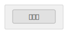

| プロパティ | 型     | 説明         |
| ---------- | ------ | ------------ |
| `text`     | string | 表示テキスト |

デフォルトサイズ: 80 × 26

---

#### textbox（テキストボックス）

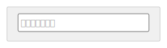

| プロパティ    | 型     | 説明             |
| ------------- | ------ | ---------------- |
| `text`        | string | 入力テキスト     |
| `placeholder` | string | プレースホルダー |

デフォルトサイズ: 150 × 24

---

#### textarea（テキストエリア）

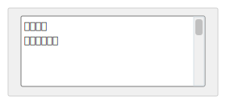

| プロパティ    | 型     | 説明             |
| ------------- | ------ | ---------------- |
| `text`        | string | 入力テキスト     |
| `placeholder` | string | プレースホルダー |
| `readOnly`    | bool   | 読み取り専用     |

デフォルトサイズ: 200 × 80

---

#### label（ラベル）

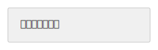

| プロパティ | 型     | 説明         |
| ---------- | ------ | ------------ |
| `text`     | string | 表示テキスト |

デフォルトサイズ: 自動 × 20

---

#### linklabel（リンクラベル）

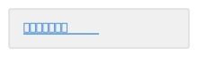

| プロパティ | 型     | 説明         |
| ---------- | ------ | ------------ |
| `text`     | string | 表示テキスト |
| `url`      | string | リンク先 URL |

デフォルトサイズ: 自動 × 20

---

#### combobox（コンボボックス）

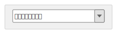

| プロパティ | 型       | 説明           |
| ---------- | -------- | -------------- |
| `text`     | string   | 選択中テキスト |
| `items`    | string[] | 選択肢リスト   |

デフォルトサイズ: 150 × 24

---

#### checkbox（チェックボックス）

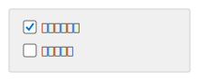

| プロパティ | 型     | 説明         |
| ---------- | ------ | ------------ |
| `text`     | string | 表示テキスト |
| `checked`  | bool   | チェック状態 |

デフォルトサイズ: 自動 × 20

---

#### radiobutton（ラジオボタン）

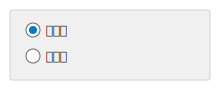

| プロパティ | 型     | 説明         |
| ---------- | ------ | ------------ |
| `text`     | string | 表示テキスト |
| `selected` | bool   | 選択状態     |

デフォルトサイズ: 自動 × 20

---

#### group（グループ）

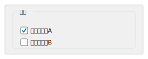

| プロパティ | 型                  | 説明                 |
| ---------- | ------------------- | -------------------- |
| `text`     | string              | グループラベル       |
| `controls` | ControlDefinition[] | 子コントロールリスト |

デフォルトサイズ: 指定必須

```yaml
- type: group
  text: '設定'
  x: 10
  y: 10
  width: 300
  height: 100
  controls:
      - type: checkbox
        text: 'オプションA'
        x: 15
        y: 15
        checked: true
```

---

#### datagrid（データグリッド）

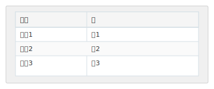

| プロパティ | 型                 | 説明     |
| ---------- | ------------------ | -------- |
| `columns`  | ColumnDefinition[] | 列定義   |
| `rows`     | string[][]         | 行データ |

デフォルトサイズ: 指定必須

```yaml
- type: datagrid
  x: 10
  y: 10
  width: 400
  height: 200
  columns:
      - header: '名前'
        width: 150
      - header: '値'
        width: 250
  rows:
      - ['項目1', '値1']
      - ['項目2', '値2']
```

---

#### menubar（メニューバー）

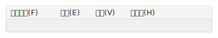

| プロパティ | 型       | 説明         |
| ---------- | -------- | ------------ |
| `items`    | string[] | メニュー項目 |

デフォルトサイズ: コンテナ幅 × 22

---

#### statusbar（ステータスバー）

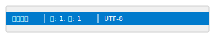

| プロパティ | 型       | 説明               |
| ---------- | -------- | ------------------ |
| `items`    | string[] | ステータスバー項目 |

デフォルトサイズ: コンテナ幅 × 22

---

#### tabcontrol（タブコントロール）

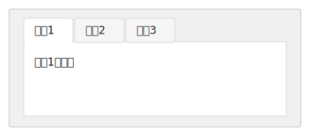

| プロパティ  | 型              | 説明               |
| ----------- | --------------- | ------------------ |
| `tabs`      | TabDefinition[] | タブ定義           |
| `activeTab` | int             | アクティブタブ番号 |

デフォルトサイズ: 指定必須

```yaml
- type: tabcontrol
  x: 10
  y: 10
  width: 400
  height: 300
  activeTab: 0
  tabs:
      - text: 'タブ1'
        controls:
            - type: label
              text: 'タブ1の内容'
              x: 10
              y: 10
      - text: 'タブ2'
        controls: []
```

---

#### listbox（リストボックス）

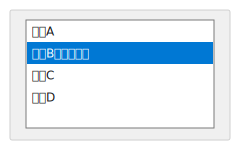

| プロパティ      | 型       | 説明               |
| --------------- | -------- | ------------------ |
| `items`         | string[] | 項目リスト         |
| `selectedIndex` | int      | 選択中インデックス |

デフォルトサイズ: 指定必須

---

#### panel（パネル）

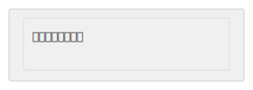

| プロパティ | 型                  | 説明                 |
| ---------- | ------------------- | -------------------- |
| `controls` | ControlDefinition[] | 子コントロールリスト |

デフォルトサイズ: 指定必須

---

#### image（画像プレースホルダ）

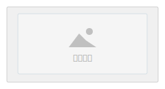

| プロパティ | 型     | 説明         |
| ---------- | ------ | ------------ |
| `text`     | string | 代替テキスト |

デフォルトサイズ: 指定必須

---

#### progressbar（プログレスバー）

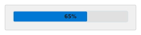

| プロパティ | 型  | 説明            |
| ---------- | --- | --------------- |
| `value`    | int | 進捗値（0-100） |

デフォルトサイズ: 200 × 20

---

#### numericupdown（数値入力）

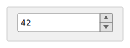

| プロパティ | 型  | 説明   |
| ---------- | --- | ------ |
| `value`    | int | 現在値 |
| `minimum`  | int | 最小値 |
| `maximum`  | int | 最大値 |

デフォルトサイズ: 100 × 24

---

#### datetimepicker（日付時刻入力）

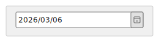

| プロパティ | 型     | 説明                                      |
| ---------- | ------ | ----------------------------------------- |
| `dateText` | string | 表示する日付テキスト                      |
| `format`   | string | フォーマット（`short` / `long` / `time`） |

デフォルトサイズ: 180 × 24

---

#### treeview（ツリービュー）

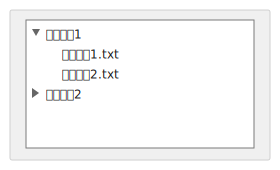

| プロパティ | 型                   | 説明       |
| ---------- | -------------------- | ---------- |
| `nodes`    | TreeNodeDefinition[] | ノード定義 |

デフォルトサイズ: 指定必須

```yaml
- type: treeview
  x: 10
  y: 10
  width: 250
  height: 200
  nodes:
      - text: 'フォルダ1'
        expanded: true
        children:
            - text: 'ファイル1.txt'
            - text: 'ファイル2.txt'
      - text: 'フォルダ2'
        expanded: false
        children:
            - text: 'ファイル3.txt'
```

---

#### toolbar（ツールバー）

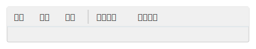

| プロパティ | 型       | 説明                                       |
| ---------- | -------- | ------------------------------------------ |
| `items`    | string[] | ボタン項目（`"\|"` or `"-"` でセパレータ） |

デフォルトサイズ: コンテナ幅 × 28

---

## YAML 定義の例

### 最小構成

```yaml
screen:
    title: 'シンプルな画面'
window:
    title: 'サンプル'
    width: 400
    height: 200
    controls:
        - type: label
          text: 'Hello, World!'
          x: 20
          y: 20
```

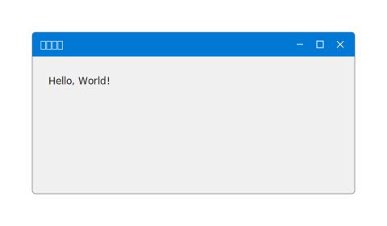

### アノテーション付き

```yaml
screen:
    title: '入力フォーム'
    description: 'ユーザー情報を入力するフォームです。'
window:
    title: 'ユーザー登録'
    width: 500
    height: 300
    controls:
        - type: label
          text: '名前:'
          x: 20
          y: 20
        - type: textbox
          id: nameInput
          x: 80
          y: 15
          width: 200
          placeholder: '氏名を入力'
        - type: button
          id: submitBtn
          x: 80
          y: 60
          text: '登録'
annotations:
    - target: nameInput
      label: '①'
      description: 'ユーザーの氏名を入力します。'
    - target: submitBtn
      label: '②'
      description: '入力内容を登録します。'
```


### 部分描画（chrome: false）

ウィンドウの一部分だけを描画したい場合、`chrome: false` を指定するとタイトルバーや
ウィンドウ装飾を省略してコンテンツ領域のみを出力できます。

```yaml
screen:
    title: 'フォーム部分'
window:
    title: ''
    width: 420
    height: 260
    chrome: false
    controls:
        - type: label
          text: '氏名'
          x: 16
          y: 16
        - type: textbox
          x: 100
          y: 12
          width: 300
          placeholder: '例）山田 太郎'
        - type: button
          x: 310
          y: 210
          width: 90
          text: '保存'
```


## プロジェクト構成

```text
VehicleVision.Tools.ScreenSketch/
├── .github/                    # GitHub設定（CI/CD、セキュリティポリシー等）
│   ├── copilot-instructions.md
│   ├── SECURITY.md
│   └── workflows/
│       ├── ci.yml
│       └── release.yml
├── .vscode/                    # VS Code設定
│   ├── extensions.json
│   ├── settings.json
│   └── tasks.json
├── docs/                       # ドキュメント
│   └── contributing/           # 開発者向けガイドライン
├── VehicleVision.Tools.ScreenSketch/
│   ├── Generation/             # Markdown生成ロジック
│   ├── Models/                 # YAML定義モデル
│   ├── Rendering/              # SVGレンダリング・テーマ
│   └── Samples/                # サンプルYAMLファイル
├── LICENSES/                   # サードパーティライセンス
├── .editorconfig
├── .gitignore
├── .markdownlint-cli2.jsonc
├── .prettierignore
├── .prettierrc
├── AUTHORS
├── CONTRIBUTING.md
├── LICENSE
├── README.md
└── package.json
```

## サードパーティライセンス

このプロジェクトは以下のサードパーティライブラリを使用しています：

| ライブラリ | ライセンス | 著作権                      |
| ---------- | ---------- | --------------------------- |
| YamlDotNet | MIT        | Copyright (c) Antoine Aubry |

ライセンスファイルの全文は [LICENSES](./LICENSES/) フォルダを参照してください。

## セキュリティ

セキュリティ上の脆弱性を発見された場合は、[セキュリティポリシー](.github/SECURITY.md)をご確認の上、ご報告ください。

## ライセンス

このプロジェクトは AGPL-3.0 ライセンスの下で公開されています。詳細は [LICENSE](LICENSE) を参照してください。

## 謝辞

セキュリティ脆弱性の報告やプロジェクトへの貢献をしてくださった方々に感謝いたします。

<!-- 貢献者・報告者はこちらに追記 -->
