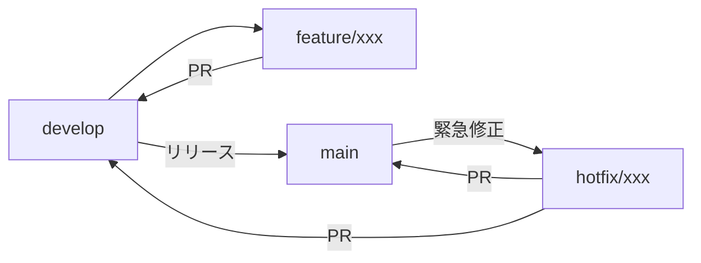

# ブランチ戦略とリリース手順

このドキュメントでは、本リポジトリのブランチ戦略とリリース手順について説明します。

本プロジェクトでは **GitFlow** をベースとしたブランチ戦略を採用しています。

<!-- START doctoc generated TOC please keep comment here to allow auto update -->
<!-- DON'T EDIT THIS SECTION, INSTEAD RE-RUN doctoc TO UPDATE -->

<!-- END doctoc generated TOC please keep comment here to allow auto update -->

---

## GitFlow 概要

- `main`: リリース済みの安定版
- `develop`: 開発中の最新版
- 機能追加やバグ修正は作業ブランチで行い、PR経由でマージする

---

## ブランチ構成

### メインブランチ

| ブランチ  | 用途             | 保護 |
| --------- | ---------------- | ---- |
| `main`    | リリース済み安定 | あり |
| `develop` | 開発最新         | あり |

### 作業ブランチ

| プレフィックス | 用途                                | 例                             |
| -------------- | ----------------------------------- | ------------------------------ |
| `feature/`     | 新機能の追加                        | `feature/add-export-api`       |
| `bug/`         | バグ修正                            | `bug/fix-null-reference`       |
| `hotfix/`      | 本番環境の緊急修正（main から分岐） | `hotfix/critical-security-fix` |
| `docs/`        | ドキュメントのみの変更              | `docs/update-readme`           |
| `refactor/`    | リファクタリング（機能変更なし）    | `refactor/cleanup-renderer`    |

---

## ブランチの流れ

---

## ブランチ命名規則

### ルール

- **小文字とハイフン**を使用（スペースやアンダースコアは避ける）
- **短く明確**な説明を心がける
- **Issue 番号**がある場合は含めてもよい（例: `bug/123-fix-null-check`）

---

## リリース手順

1. `develop` ブランチの内容を確認
2. `main` ブランチへマージ（PR経由）
3. GitHub Actions の `Create Release` ワークフローを手動実行
4. バージョン種別（patch / minor / major）を選択
5. 自動的にバージョン更新・タグ作成・リリース作成が実行される

詳細は [CI/CDワークフロー](ci-workflow.md) を参照。
