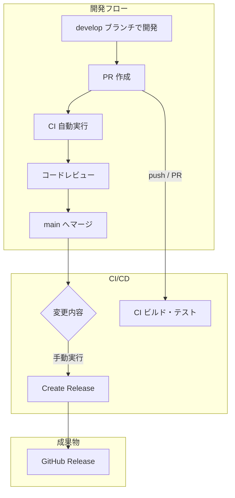
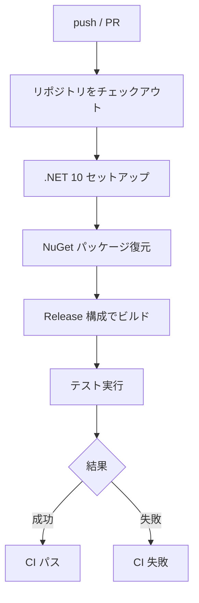
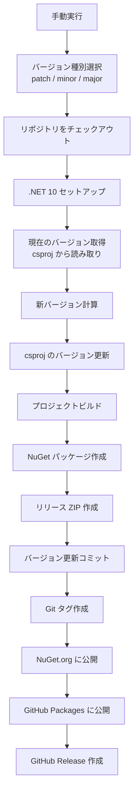
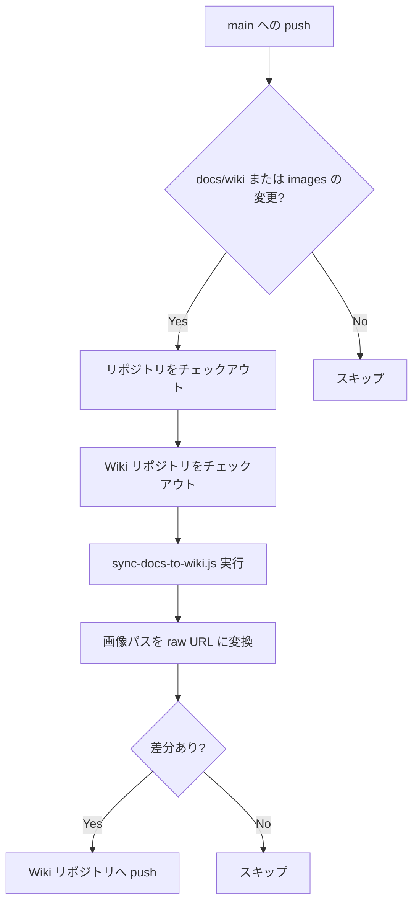

# CI/CD ワークフロー

このドキュメントでは、VehicleVision.Tools.ScreenSketch プロジェクトの CI/CD ワークフローについて説明します。

<!-- START doctoc generated TOC please keep comment here to allow auto update -->
<!-- DON'T EDIT THIS SECTION, INSTEAD RE-RUN doctoc TO UPDATE -->

<!-- END doctoc generated TOC please keep comment here to allow auto update -->

---

## ワークフロー一覧

| ワークフロー   | ファイル         | トリガー                             | 目的                                  |
| -------------- | ---------------- | ------------------------------------ | ------------------------------------- |
| CI             | `ci.yml`         | main / develop への push・PR         | ビルド・テストの自動実行              |
| Create Release | `release.yml`    | 手動実行（main ブランチのみ）        | バージョンアップ、GitHub Release 作成 |
| Sync Wiki      | `sync-wiki.yml`  | main への push（docs/wiki 変更時）   | docs/wiki を GitHub Wiki へ同期       |

---

## ローカルでのテスト実行

CI/CD でテストを自動実行する前に、ローカルでテストを実行することを推奨します。

### コマンド

```bash
# 全テストを実行
dotnet test

# 詳細なログを出力
dotnet test --logger "console;verbosity=detailed"

# カバレッジを収集
dotnet test --collect:"XPlat Code Coverage"
```

詳細は[テストガイドライン](testing-guidelines.md)を参照してください。

---

## 全体フロー図



---

## 1. CI ワークフロー

### 概要

プルリクエストおよびブランチへの push 時に、自動的にビルドとテストを実行する。

### トリガー

- `main` / `develop` ブランチへの push
- `main` / `develop` ブランチへのプルリクエスト

### 処理フロー



---

## 2. Create Release ワークフロー

### 概要

手動実行でバージョンアップと GitHub Release を作成する。

### トリガー

- 手動実行（`main` ブランチのみ）

### バージョン種別

| 種別    | 説明                     | 例            |
| ------- | ------------------------ | ------------- |
| `patch` | バグ修正、小さな変更     | 1.0.0 → 1.0.1 |
| `minor` | 後方互換性のある機能追加 | 1.0.0 → 1.1.0 |
| `major` | 破壊的変更               | 1.0.0 → 2.0.0 |

### 処理フロー



### 必要なシークレット

| シークレット名  | 用途                                         |
| --------------- | -------------------------------------------- |
| `GITHUB_TOKEN`  | 自動提供。コミット、タグ、リリース作成に使用 |
| `NUGET_API_KEY` | NuGet.org への公開に使用                     |

---

## 3. Sync Wiki ワークフロー

### 概要

`docs/wiki/` ディレクトリの Markdown ファイルを GitHub Wiki リポジトリへ自動同期する。

### トリガー

- `main` ブランチへの push（`docs/wiki/**` または `images/**` の変更時のみ）

### 処理フロー



---

## トラブルシューティング

### CI が失敗する

1. ローカルで `dotnet build --configuration Release` が成功するか確認
2. ローカルで `dotnet test` が成功するか確認
3. GitHub Actions のログでエラー内容を確認

### リリースワークフローが失敗する

1. `main` ブランチから実行しているか確認
2. csproj に `<Version>` タグが存在するか確認
3. `develop` ブランチが存在するか確認（リリース後のマージに必要）

---

## 関連ドキュメント

- [ブランチ戦略とリリース手順](branch-strategy.md)
- [テストガイドライン](testing-guidelines.md)
