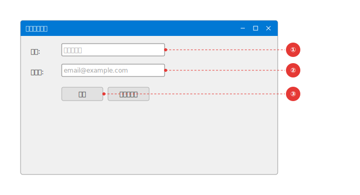
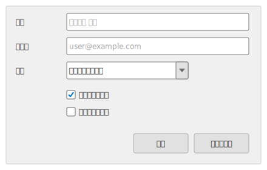
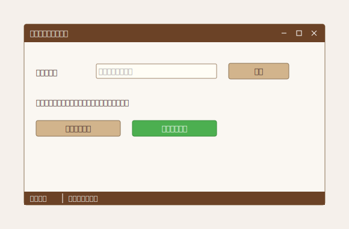

# YAML 定義の例

---

## 最小構成

```yaml
screen:
    title: 'シンプルな画面'
window:
    title: 'サンプル'
    width: 400
    height: 200
    controls:
        - type: label
          text: 'Hello, World!'
          x: 20
          y: 20
```


---

## アノテーション付き

```yaml
screen:
    title: '入力フォーム'
    description: 'ユーザー情報を入力するフォームです。'
window:
    title: 'ユーザー登録'
    width: 500
    height: 300
    controls:
        - type: label
          text: '名前:'
          x: 20
          y: 20
        - type: textbox
          id: nameInput
          x: 80
          y: 15
          width: 200
          placeholder: '氏名を入力'
        - type: button
          id: submitBtn
          x: 80
          y: 60
          text: '登録'
annotations:
    - target: nameInput
      label: '①'
      description: 'ユーザーの氏名を入力します。'
    - target: submitBtn
      label: '②'
      description: '入力内容を登録します。'
```



---

## 部分描画（chrome: false）

ウィンドウの一部分だけを描画したい場合、`chrome: false` を指定するとタイトルバーや
ウィンドウ装飾を省略してコンテンツ領域のみを出力できます。

```yaml
screen:
    title: 'フォーム部分'
window:
    title: ''
    width: 420
    height: 260
    chrome: false
    controls:
        - type: label
          text: '氏名'
          x: 16
          y: 16
        - type: textbox
          x: 100
          y: 12
          width: 300
          placeholder: '例）山田 太郎'
        - type: button
          x: 310
          y: 210
          width: 90
          text: '保存'
```



---

## カスタムテーマ

`theme: custom` と `customTheme` を指定すると、ユーザー独自の配色を定義できます。
指定しなかった色は標準テーマにフォールバックするため、変更したい色だけを記述すれば十分です。

```yaml
screen:
    title: 'カスタムテーマ'
    theme: custom
    customTheme:
        canvasBackground: '#F5F0EB'
        windowBackground: '#FAF7F2'
        windowBorder: '#8B7355'
        titleBarBackground: '#6B4226'
        titleBarText: '#FFFFFF'
        buttonBackground: '#D2B48C'
        buttonBorder: '#8B7355'
        buttonText: '#3E2723'
        textBoxBackground: '#FFFDF5'
        textBoxBorder: '#A0866C'
        labelText: '#3E2723'
        statusBarBackground: '#6B4226'
        statusBarText: '#FFFFFF'
window:
    title: 'カスタムテーマ画面'
    width: 500
    height: 300
    controls:
        - type: label
          text: 'ユーザー名'
          x: 20
          y: 40
        - type: textbox
          x: 120
          y: 36
          width: 200
          placeholder: '入力してください'
        - type: button
          text: '登録'
          x: 340
          y: 35
          width: 100
        - type: statusbar
          items: [準備完了, 'カスタムテーマ']
```



指定可能なプロパティの一覧は [YAML 定義リファレンス](YAML-Definition-Reference) を参照してください。
