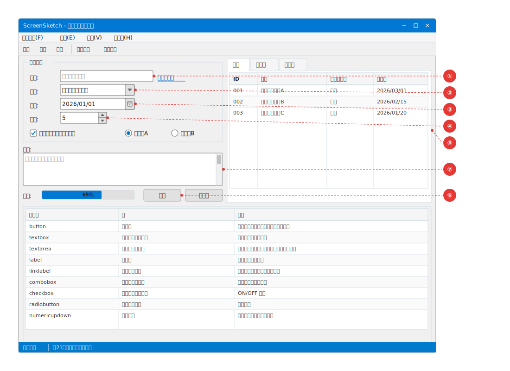

# VehicleVision.Tools.ScreenSketch

YAML で画面レイアウトを定義し、SVG 画像 + Markdown ドキュメントを自動生成するツールです。

## 機能

- **generate**: YAML ファイルから SVG 画面イメージ + Markdown ドキュメントを新規生成
- **transform**: Markdown 内の ` ```yaml-screen ` コードブロックを SVG + テーブルにインライン変換
- **restore**: 変換済みブロックを元の ` ```yaml-screen ` コードブロックに復元
- **render**: stdin から YAML を読み取り、stdout に SVG を出力（VS Code 拡張等のパイプ連携用）
- **VS Code 拡張**: Markdown プレビューで `yaml-screen` ブロックをリアルタイム SVG 表示

## 画面イメージのサンプル

全コントロールを網羅したサンプルです。



## ドキュメント

- [コマンドリファレンス](Command-Reference) — 各コマンドの使い方と引数
- [YAML 定義リファレンス](YAML-Definition-Reference) — ドキュメント構造・screen・window・annotations・connectors
- [対応コントロール](Controls) — 全コントロールのプロパティと画像
- [YAML 定義の例](Examples) — 最小構成・アノテーション付き・部分描画・コネクタ線
- [VS Code 拡張](VS-Code-Extension) — Screen Sketch Preview の導入と設定
